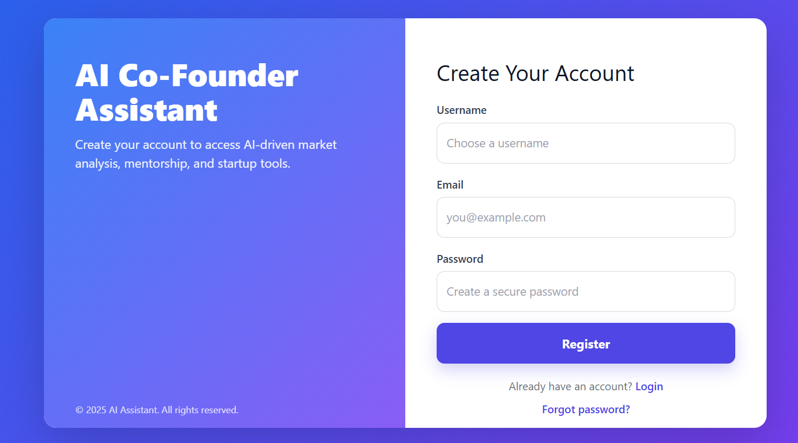
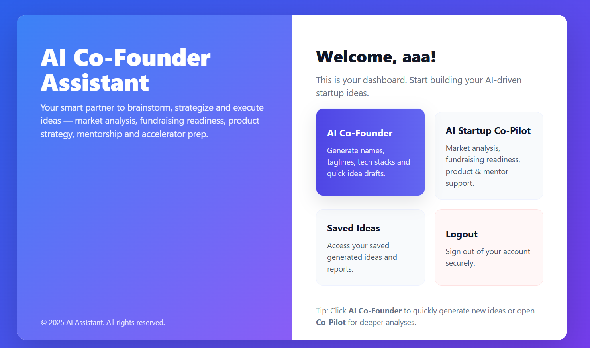
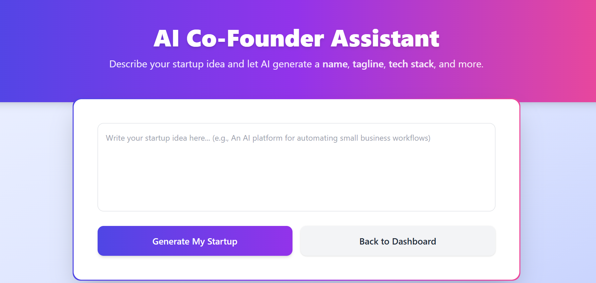
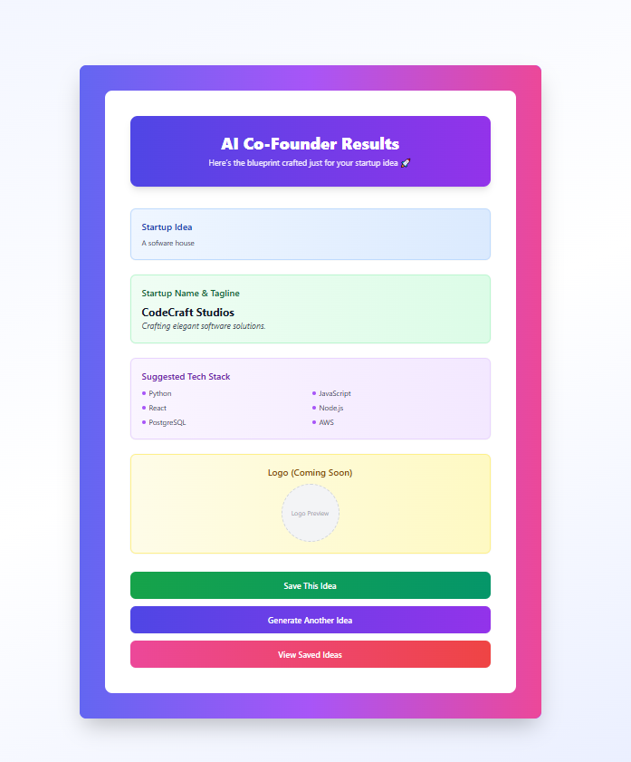
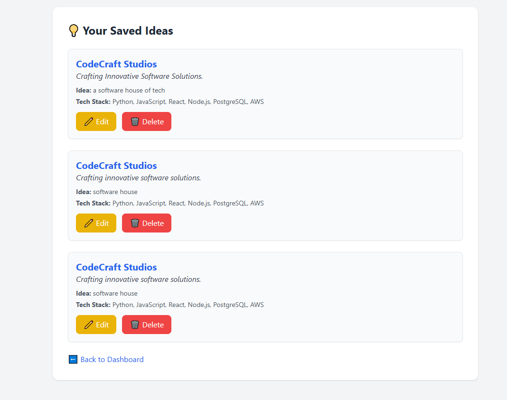
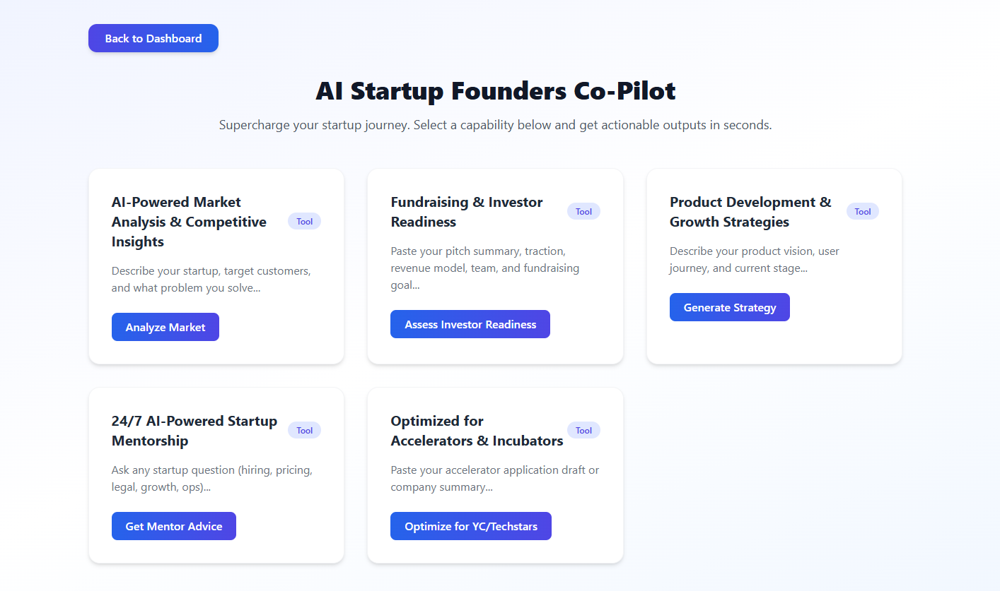

# 🧠 AI Co-Founder

[](https://www.python.org/)  
[](https://pytorch.org/)  
[](https://huggingface.co/transformers/)  
[](LICENSE)

> An AI-powered assistant that helps you brainstorm, analyze, and build projects using modern machine learning and natural language processing. Built with PyTorch, Hugging Face Transformers, and Datasets.  

---

## 🚀 Features

- 🤖 **AI Assistant** powered by state-of-the-art language models  
- 📊 **Dataset Integration** using Hugging Face datasets  
- 🛠 **Model Training & Evaluation** with scikit-learn & PyTorch  
- 🔌 **Modular and Extensible** codebase for research & production  

---

## ⚙️ How It Works

The **AI Co-Founder** acts like a virtual partner that supports you across the full project lifecycle:  

1. **Idea Generation & Brainstorming**  
   - Helps you explore project ideas, compare approaches, and identify use cases.  

2. **Dataset Handling**  
   - Integrates with Hugging Face Datasets for seamless access to benchmark or custom datasets.  
   - Supports preprocessing, tokenization, and splitting for training pipelines.  

3. **Model Training & Evaluation**  
   - Uses **PyTorch** and **Transformers** to fine-tune pre-trained models on your datasets.  
   - Runs evaluation with scikit-learn metrics (accuracy, F1, precision, recall).  

4. **Experiment Tracking & Prototyping**  
   - Save models into the `models/` folder for reuse.  
   - Jupyter notebooks in `notebooks/` allow quick experimentation and prototyping.  

5. **End-to-End Workflow**  
   - From brainstorming → dataset preparation → training → evaluation → feedback.  
   - Designed as a **modular system** so you can plug in new datasets or models easily.  

In short, **AI Co-Founder helps you move from concept to implementation faster**, making it a practical assistant for ML/NLP projects.  

---

## 📸 Screenshots  


##  LOGIN 
  
---------------------------------------------------
##  SIGNUP 
  
---------------------------------------------------
##  DASHBOARD 
  
---------------------------------------------------
##  AI-CO-FOUNDER 
  
---------------------------------------------------
##  AI-CO-FOUNDER RESULTS 
  
---------------------------------------------------
##  SAVED IDEAS 
  
---------------------------------------------------
##  AI-CO PILOT 
  
---------------------------------------------------
##  CO-PILOT TOOL 
  
---------------------------------------------------
---

## 📦 Installation

1. **Clone the repository**
   ```bash
   git clone https://github.com/your-username/ai-cofounder.git
   cd ai-cofounder
   ```

2. **Create and activate virtual environment**
   ```bash
   python -m venv venv
   # On Windows
   venv\Scripts\activate
   # On Mac/Linux
   source venv/bin/activate
   ```

3. **Install dependencies**
   ```bash
   pip install -r requirements.txt
   ```

⚠️ If you face issues with `scikit-learn` on Windows, run:
```bash
pip install scikit-learn --only-binary :all:
```

---

## ▶️ Usage

Run the main script:
```bash
python main.py
```

---

## 📂 Project Structure

```
ai-cofounder/
│── main.py              # Entry point
│── requirements.txt     # Dependencies
│── README.md            # Project documentation
│── data/                # Datasets (if any)
│── models/              # Saved models
│── notebooks/           # Jupyter notebooks (experiments)
│── utils/               # Helper functions
│── screenshots/         # App screenshots (optional)
```

---

## 🛠 Requirements

- Python 3.9+  
- PyTorch >= 2.0  
- Transformers == 4.40.2  
- Datasets == 2.19.1  
- Scikit-learn == 1.5.0 (or compatible)  

---

## 🤝 Contributing

Contributions are welcome! 🎉  
- Fork the repo  
- Create a feature branch (`git checkout -b feature-name`)  
- Commit your changes (`git commit -m 'Add feature'`)  
- Push to your branch (`git push origin feature-name`)  
- Open a Pull Request  

---

## 📜 License

This project is licensed under the **MIT License** © 2025 **Kashif Ali**.  
See the [LICENSE](LICENSE) file for details.  
